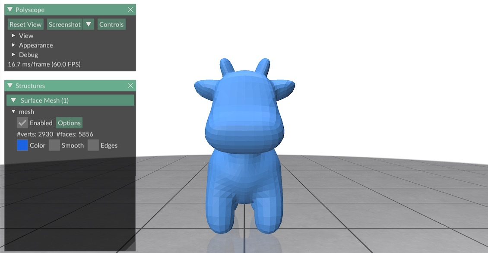
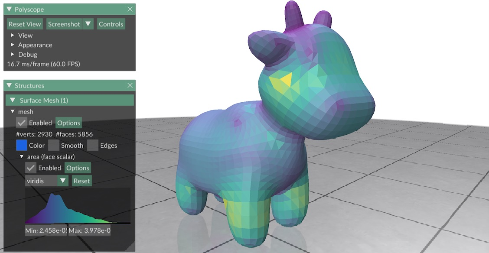

# GC-Polyscope Console

GeometryCentral and Polyscope can be used via an interactive session on the command line, on any platform that supports the _cling_ C++ interpreter.

## Installation

1. Run `git clone --recursive https://github.com/nmwsharp/gc-polyscope-project-template.git`, but **don't** follow the standard build instructions.
2. If not already installed, you will need to install cling and Eigen.  On MacOS/homebrew, these packages can be installed via `brew install cling` and `brew install eigen`.
3. Edit the file `console/gc-polyscope-cling.h`, and set the path to `eigen3` so that it points to your local install.
4. In CMakeLists.txt add the line `option(BUILD_SHARED_LIBS "Build the shared library" TRUE)` right below the line `project(gc_polyscope_example)`.
5. Now you can build as usual: from the root directory, run `mkdir build; cd build; cmake ..`.

## Usage

To start the console, just run `./gc-console` from the root directory.  From here you can type standard C++ code, and invoke commands from GeometryCentral/Polyscope.

You can also invoke an external "script", i.e., an ordinary C++ file containing GeometryCentral/Polyscope commands, by typing `.x script.cpp`.  This script must contain a method called `script()`, which will be run when you invoke the script.

Typing `.q` will end your session, and code from existing files can be loaded using the `.L` command.  Type `.help` for other commands.

Note that some common methods have been provided for convenience:

- `load_mesh( char* filename )` will load the specified mesh into a surface mesh called `mesh` and corresponding vertex position geometry called `geometry`.
- `init_view()` will initialize a Polyscope viewer, where `mesh` is registered as `psMesh`.
- `view()` will pop up the Polyscope viewer.  This viewer can be used interactively as usual; closing the window will return you to the console session.  You can run `view()` at any moment in a session.

Additional commands added to the file `gc-polyscope-cling.h` will be made available at startup.

For further information, see:

- [Cling homepage](https://github.com/root-project/cling)
- [GeometryCentral documentation](http://geometry-central.net/)
- [Polyscope documentation](https://polyscope.run/)

## Tutorial

Here's a simple example, showing how to load a mesh, compute the area of each face, and display these areas in Polyscope.  First, we start the console from the `/console/` directory, which brings up a prompt:

```
$
```

We next load the mesh `spot.obj` (which should already be sitting inside the `console/` directory):

```
$ load_mesh( "spot.obj" );
Loading spot.obj into 'mesh' and 'geometry'...
```

The mesh is now loaded into a [surface mesh object](http://geometry-central.net/surface/surface_mesh/basics/) called `mesh`, and a [geometry object](http://geometry-central.net/surface/geometry/geometry/) called `geometry`.  At this point, we can run any command we like from GeometryCentral on the mesh.  For instance, to see the number of vertices we can just write

```
$ mesh->nVertices()
(unsigned long) 2930
```

We can also write a few lines of C++ code.  For example, let's say that we want to compute the _Euler characteristic_, equal to the number of vertices minus edges plus faces (which should be equal to 2 for any sphere-like mesh).  We can write

```
$ int nV = mesh->nVertices();
$ int nE = mesh->nEdges();
$ int nF = mesh->nFaces();
$ nV - nE + nF
(int) 2
```

which yields the expected value of 2.

Next, let's say we want to visualize the mesh.  We first initialize the viewer, which only needs to happen once for our session.  To do this, just type

```
$ init_view();
Initializing Polyscope...
[polyscope] Backend: openGL3_glfw -- Loaded openGL version: 4.1 ATI-3.10.18
Registering mesh as 'psMesh'...
```

Nothing will display (yet), but notice that the object `mesh` we've been working with is now attached to the Polyscope mesh `psMesh`, which we'll use to set any attributes we want to visualize.  Before we do that, let's just take a look at the mesh—which we can do at any time by typing `view()`:

```
$ view();
```

Doing so will bring up a Polyscope window like the one shown below.  (**Note:** _this window may initially be hidden behind other windows!_)



While this window is open, our console session is paused; closing the window lets us continue typing commands on the console.

Let's now compute some data to display.  As a simple example, we'll just compute the area of each face, stored in a [face data array](http://geometry-central.net/surface/surface_mesh/containers/):

```
$ FaceData<double> data( *mesh );
$ for( Face f : mesh->faces() ) {
$ ?   data[f] = geometry->faceArea(f);
$ ?   }
```

We can now attach this data to the Polyscope mesh `psMesh` via

```
[cling]$ psMesh->addFaceScalarQuantity( "area", data );
```

The first argument just provides a label for this data in the viewer.  To display the data, we can again type

```
$ view();
```

which brings up a view like the one below. (**Note:** You must click the check box "Enabled" to see the data!)



Finally, suppose we want to capture everything we've done as a script, so we can easily run it again rather than re-typing it from the command line.  We can dump everything we've typed into a file `process.cpp` that looks like this:

```
void process()
{
   load_mesh( "spot.obj" );
   init_view();

   FaceData<double> data( *mesh );
   for( Face f : mesh->faces() ) {
      data[f] = geometry->faceArea(f);
   }
   psMesh->addFaceScalarQuantity( "area", data );

   view();
}
```

**Important**: notice that the _name of the function is the same as the file_.  This file can contain other subroutines, but `process()` is the one that will be invoked when we execute it.  To run this script, we now just have to start up the console and execute it:

```
./gc-console 
$ .x process.cpp
```

which should bring up the same final view we had before.

From here, the sky's the limit!  Take a look at the documentation links above for more information.